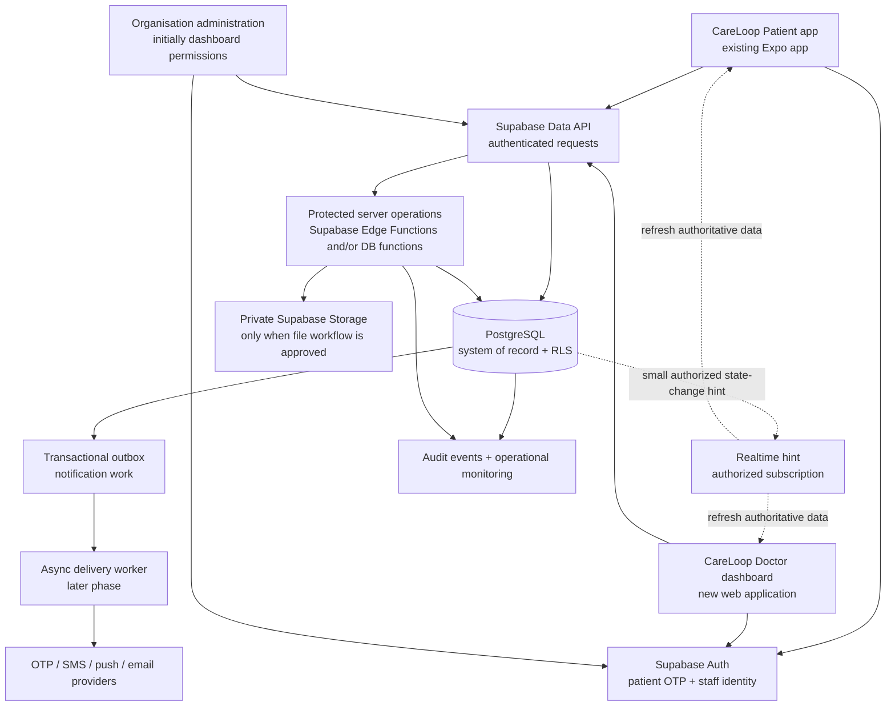

# CareLoop Target Architecture

**Purpose:** Architecture for the CareLoop Doctor dashboard and the shared backend used with the existing Patient app.
**Status:** Dashboard and backend implementation are present; production provider configuration and the remaining patient QR snapshot journey are listed as follow-up work.
**Primary design principle:** Make the first system secure, understandable, testable, and evolvable. Do not add distributed infrastructure until measured needs justify it.

---

## 1. Executive architecture

CareLoop has two independent user experiences and one authoritative backend:



### Decisions this architecture makes

1. **One Supabase project per environment, shared by both real apps.** Patient and Doctor are separate clients, not separate data silos. Use separate development/staging/production projects, not separate Patient-versus-Doctor databases.
2. **PostgreSQL is the source of truth.** Client caches, push messages, realtime events, and dashboard summaries are never authoritative.
3. **Start as a modular monolith.** One database with clear domain boundaries, RLS, migrations, and a small number of server operations. No microservices, Kubernetes, or event broker for the initial product.
4. **Database-enforced authorization.** RLS and SQL constraints protect records even if a client bypasses its UI. Edge Functions handle workflows and external integrations that need server-side logic.
5. **Build the Doctor dashboard first, but model both clients now.** Patient ownership, consent, access scopes, and patient-app contracts must exist in the initial design so later integration is not a redesign.
6. **Demo is isolated.** Demo credentials, demo data, demo endpoints, and demo storage never cross into real project environments.

Supabase documents RLS as the database authorization layer and cautions that grants and policies both need to be configured for exposed tables: [RLS](https://supabase.com/docs/guides/database/postgres/row-level-security). Supabase also supports local development with version-controlled migrations: [local workflow](https://supabase.com/docs/guides/local-development/cli-workflows).

---

## 2. Product boundary and user roles

### Applications

| Client | Purpose | Authentication | Data boundary |
|---|---|---|---|
| Patient app | Patient identity, consent, own connection, appointments, responses, approved reminders | Supabase phone OTP (subject to provider and country availability) | Patient’s linked record and expressly connected team data |
| Doctor dashboard | Staff patient list, work queue, connection requests, appointment/follow-up coordination | Staff sign-in selected for launch; stronger MFA for privileged roles | Current organisation/team membership and explicit patient relationship |
| Admin capability | Provision org/team/memberships, manage policy, support workflows | Restricted staff identity, MFA, audited administration | Own organisation only; no broad platform access by default |

Do not make the Doctor app trust a `role` string sent by the browser. The backend loads staff role and membership from authoritative database rows. User-editable Auth metadata is not an authorization source.

### Role model (initial proposal)

- **Patient:** access own profile and own patient record; grant/withdraw connection consent; respond to own coordination tasks.
- **Doctor:** read/write permitted patient coordination records in assigned organisation/team; create invitations if granted that permission.
- **Care coordinator:** manage assigned follow-up actions and communication within permitted patient/team scope; no implied clinical authority.
- **Organisation admin:** manage that organisation’s staff membership and settings; patient access should be separately scoped and auditable.
- **Platform operator:** no routine patient-content access. Any exceptional access must be time-limited, justified, approved, and audited.

Finalize role names and action permissions before policies are authored.

---

## 3. Backend modules and ownership

Keep modules inside one Supabase/Postgres project initially. Domain ownership means each workflow has a clear place for rules and tests; it does not mean each module gets a separate service.

### Identity and tenancy

- Auth identity is the login subject, not the patient chart itself.
- `profiles` associates Auth users with CareLoop account state and application-level role category.
- `organisations`, `care_teams`, `care_team_memberships` define staff tenancy and scope.
- Staff membership is granted through an admin-controlled onboarding process; signup alone grants no patient access.
- Patient-account-to-patient-record linking is an explicit, audited workflow. Phone OTP alone must not silently attach an account to a chart.

### Patient and connection

- `patients`: minimum identifiers needed for care coordination, organisation ownership, and the approved identity match.
- `patient_care_team_connections`: the patient’s current consented relationship(s) with a team.
- `connection_invitations`: opaque, expiring, revocable one-time invitations; token hash only at rest.
- `connection_consents`: durable, versioned consent evidence and scope.

### Follow-up operations

- `appointments` and appointment status history.
- `follow_up_tasks`: reason, due date, priority source, owner, patient/team, state, and next action.
- `contact_attempts` and `patient_responses`: events, not overwritten narrative state.
- `care_journey_events`: a patient-visible/authorized operational timeline, carefully scoped.
- `reminders` and `notifications`: delivery intent and state, not clinical truth.

### Platform capabilities

- `audit_events`: append-only security-sensitive events with safe metadata.
- `outbox_events`: committed work that must be delivered asynchronously.
- Storage metadata and private file objects only after a file workflow, retention policy, access rules, and malware strategy are approved.

Use normalized relational records for authoritative entities. Add read-optimized views/materialized views only when measured query patterns require them; make sure views do not bypass intended security rules.

---

## 4. Trust boundaries and request handling

### Normal authorized read

```text
App session + publishable key
  → Supabase validates user JWT
  → SQL grants permit the operation
  → RLS checks user + membership + patient relationship
  → query returns permitted rows only
```

### Sensitive workflow write

```text
App session + validated request
  → protected operation verifies JWT and input
  → backend checks current DB membership / patient link / state
  → transaction applies constraints and idempotency
  → domain row + audit row + outbox row commit together
  → response returns stable result code and IDs
```

Use direct RLS-protected queries for straightforward reads and safe low-risk updates. Use a narrow Edge Function or database function for operations that must be atomic, secret-bearing, rate-limited, provider-integrated, or protected against races. Do not route every basic CRUD call through an Edge Function by default.

**Never ship** a service-role key, database password, SMS provider secret, or unrestricted credential in either app bundle. Validate function JWTs and caller permissions explicitly. Fix `search_path` and grants on privileged database functions.

---

## 5. End-to-end workflow designs

### A. Staff onboarding and login

```text
Org admin provisions staff invitation
  → invited staff authenticates with approved method
  → backend matches invitation identity and expiry
  → transaction creates profile + org/team membership + audit event
  → Doctor dashboard loads role-scoped workspace
```

A staff account with no current membership sees no patient rows. Deactivation removes access based on current database membership; stale frontend state or old role claims must not preserve access.

### B. Patient OTP and account linking

```text
Patient enters phone
  → Auth sends OTP through configured provider
  → patient verifies OTP
  → backend creates/loads account profile
  → explicit identity-link process associates the account with a patient record
  → patient sees only the linked record
```

The identity-link process is a design gate. Define behavior for shared numbers, changed numbers, duplicate charts, minors/guardians, and failed matches before enabling real patient onboarding. Do not create a patient-chart association solely because a frontend submits a patient ID.

### C. Doctor invites patient; patient reviews and consents

```text
Doctor selects existing patient
  → backend confirms staff role + org/team access
  → cryptographic one-time token generated; only hash stored
  → QR/code shown once, with short expiry and revoke option
  → patient scans/types code and authenticates
  → backend previews minimum doctor/team identity (not medical data)
  → patient reviews scope and explicit consent text
  → one transaction creates consent + active connection + invitation redemption
  → audit + outbox committed in same transaction
  → both apps refetch authoritative connection state
```

Important invariants:

- The QR contains no patient ID, name, diagnosis, appointment, or other health information.
- Preview is non-consuming; cancel does not burn the code.
- Consent and activation happen atomically; a scan never activates a connection.
- Expiry and revocation are enforced by server time/state, not by the UI.
- Idempotent retry returns the same outcome without duplicate connection, consent, audit, or notification effects.
- Wrong-phone or ambiguous identity results in assisted resolution, not automatic matching.

### D. Continuity-of-care follow-up

```text
Doctor/care team creates or imports an appointment/milestone
  → backend stores due date and source
  → due/missed rule emits an explainable follow-up task
  → task is assigned to a responsible team member
  → owner records contact attempt / next action
  → patient receives minimal-content reminder and responds in Patient app
  → backend updates task state and event history
  → Doctor dashboard and Patient app refetch current authorized state
```

Every work item should answer: **why is it visible, who owns it, what is next, when is it due, and what evidence closes it?** Priority must be explainable and sourced from explicit event/rule inputs. V1 should not make disease-risk predictions or autonomously change clinical care.

### E. Notifications and asynchronous work

The database transaction writes the state change and an outbox item together. A worker claims outbox items, sends through a provider adapter, records provider result, retries transient failures with backoff, and exposes permanent failures for operations staff. Notification payloads should avoid PHI; clients fetch details after authentication.

Start with the smallest supported scheduler/queue capability. Supabase Queues or another durable worker can be selected when retries, volume, and delivery guarantees are defined. Do not make synchronous database transactions wait on SMS/email/push providers.

### F. Realtime and client synchronization

Realtime is a hint to refresh, never the truth. On event, reconnect, resume, or missed subscription, clients refetch through normal RLS. Authorize private channels and emit minimal payloads. Supabase currently documents Broadcast as recommended for many scalable/security-sensitive subscriptions, while Postgres Changes is simpler but has scale tradeoffs: [Realtime subscriptions](https://supabase.com/docs/guides/realtime/subscribing-to-database-changes).

---

## 6. Authorization matrix (initial draft)

| Data/action | Patient | Doctor/coordinator | Org admin | Signed out |
|---|---|---|---|---|
| Read own profile | Own | Own | Own | No |
| Read patient record | Linked own patient only | Current authorised org/team/patient scope | As explicitly granted; org-limited | No |
| Read connection | Own current connection | Connected team scope | Org-limited/audited | No |
| Create connection invite | No | Permitted staff role, assigned patient | Within org if authorized | No |
| Preview invitation | Authenticated intended patient only | No | No | No |
| Accept invitation | Own verified identity + explicit consent | No | No | No |
| Create follow-up task | No clinical task creation | Permitted assigned patient/team | Policy-defined | No |
| Respond to own task | Own permitted response | Record staff response within role | Policy-defined | No |
| Grant staff membership | No | No | Own organisation only | No |
| Read audit | Own consent evidence as allowed | Minimum relevant events | Org audit scope | No |

This is a starting matrix, not final product policy. Convert it into test cases before writing RLS.

---

## 7. Data consistency and state rules

- Use foreign keys, unique constraints, check constraints, and indexes to enforce invariants in Postgres.
- Keep history as event rows for status changes, consent changes, contact attempts, and ownership changes; avoid losing accountability through silent overwrites.
- Use UTC timestamps in storage and render local time at the UI boundary.
- Use idempotency keys for create/accept/notification operations that may be retried.
- State-changing functions use transactions and lock the relevant invitation/task row where concurrent operations could conflict.
- Use optimistic concurrency/version columns for edits where two staff members may update the same task.
- Treat imported HIS/EMR data as source-attributed and reconcile conflicts explicitly; do not silently overwrite manually verified data.

---

## 8. Security, privacy, and clinical boundaries

### Required engineering controls

- RLS enabled for every exposed table; explicit least-privilege SQL grants; policies tested for allow **and** deny cases.
- Database-driven role/membership checks, not client role claims or user-editable metadata.
- Strong staff authentication/MFA policy; patient OTP abuse limits and recovery flows.
- Token hashing, expiry, single-use, revocation, and redaction for connection codes.
- Secrets only in managed server-side secrets; rotate and audit access.
- Minimize data collected, returned, logged, and placed in push/SMS/email.
- Append-only or tightly controlled audit writes for security-critical events.
- Private storage buckets, short-lived signed access, size/type limits, malware scanning and retention rules if files are introduced.
- Dependency scanning, secret scanning, migration review, backup restore exercises, and incident response process.

Supabase’s hosted platform does not make a health product compliant automatically; configuration, contracts, operations, and local legal requirements remain part of the system. Its HIPAA guidance is US-specific and describes shared responsibilities: [Supabase HIPAA guidance](https://supabase.com/docs/guides/security/hipaa-compliance). Confirm launch jurisdiction and approved data before using real patient data.

### Clinical boundary

CareLoop V1 organizes follow-up work. It may surface factual workflow signals such as “appointment overdue,” “investigation not recorded,” “no response,” or “unassigned.” Any condition-specific pathway must be authored/approved by a qualified clinical owner and remain explainable. No model or heuristic should diagnose, predict a disease, or prescribe based on patient data in this architecture.

---

## 9. Reliability, scale, and evolution

### Start simple, scale deliberately

For the hackathon/MVP, a modular Supabase/Postgres backend is the right starting architecture. “National-scale architecture” should mean clean tenancy, security, observability, and measured scaling paths—not premature microservices.

1. Start with database indexes for actual patient-list, due-task, team-scope, and timeline queries.
2. Paginate patient lists and timelines; never fetch an entire organisation’s patient set to the browser.
3. Keep RLS predicates indexed and avoid expensive per-row policy logic.
4. Monitor query latency, error rates, active connections, Realtime volume, and Edge Function failures.
5. Load-test realistic peaks and tenant distribution before claiming capacity. Supabase production guidance recommends security review, index/query checks, load testing, and availability planning: [production checklist](https://supabase.com/docs/guides/deployment/going-into-prod).
6. Use a connection pooler for workloads that create many short-lived connections; choose pool mode appropriate to the client/runtime: [connection pooling](https://supabase.com/docs/guides/database/connecting-to-postgres/pooling-and-limits).
7. Add workers/queues for durable notifications and imports when demonstrated needs justify them.
8. Add read replicas, partitioning, or service extraction only after metrics show a bottleneck and isolation boundaries are understood.

### When to split a module into a service

Only consider a separately deployed service when one domain has distinct scaling, reliability, security, or release needs that cannot be met in the modular monolith. Before splitting, define event ownership, retry/idempotency, data consistency, observability, and cross-service failure behavior. A national audience alone is not a reason to start with microservices.

---

## 10. Deployment and environments

```text
Local developer environment
  → shared development Supabase project
  → staging/preview environment with synthetic data
  → production project only after sign-off
```

- Store schema changes in ordered SQL migrations in version control; do not rely on undocumented dashboard edits.
- Generate and review TypeScript database types from the schema for both clients.
- Keep distinct Auth provider settings, secrets, callback URLs, and storage buckets per environment.
- CI should run formatting/type checks, unit tests, migration replay, RLS integration tests, Edge Function tests, and dependency/secret scans.
- Production promotion requires an approved migration, backup/recovery plan, monitoring, and rollback/forward-fix procedure.
- Never copy real production patient data into local or hackathon environments. Use synthetic fixtures.

---

## 11. Observability and operating model

Every important request should carry a correlation ID through app → protected operation → database audit/outbox → worker. Logs should record technical result, actor ID, org ID where appropriate, duration, and safe error code—never OTPs, invitation tokens, access tokens, or unnecessary clinical content.

Minimum operational views:

- Auth failures and OTP delivery health.
- RLS/authorization denials and unusual access patterns.
- API/Edge Function latency, errors, and rate-limit blocks.
- Slow database queries and connection saturation.
- Invitation created/expired/revoked/accepted counts and anomalies.
- Follow-up queue age, unassigned overdue items, notification delivery/retry/dead-letter state.
- Backup status, restore test date, and migration deployment status.

Define who receives alerts, who can investigate, and what actions they can take before production launch.

---

## 12. Workspace layout target

```text
CareLoop main/
├── backend/
│   ├── README.md
│   ├── docs/
│   │   ├── TARGET_ARCHITECTURE.md
│   │   ├── IMPLEMENTATION_ROADMAP.md
│   │   └── decisions/                 # approved architecture decision records
│   ├── supabase/
│   │   ├── config.toml
│   │   ├── migrations/
│   │   ├── functions/
│   │   ├── tests/                     # RLS + database integration tests
│   │   └── seed.sql                   # synthetic local-only fixtures
│   └── packages/
│       └── database-types/             # generated/shared types, if needed
├── apps/
│   └── doctor-dashboard/              # new web application, built from scratch
└── ...existing CareLoop main project files...

CareLoop Patient/                      # existing Expo app; later connects to same backend
CareLoop/                               # demo/showcase; remains isolated
```

Do not create all directories as empty ceremony. Add each when its phase begins. Keep the actual Patient app outside this backend folder unless a deliberate monorepo migration is approved.

---

## 13. Architecture acceptance criteria

Architecture is ready to implement only when:

- Patient identity linking and recovery rules are decided.
- Staff roles and exact permitted actions are documented.
- Organisation/team tenancy and patient cardinality are decided.
- Invitation, consent, revoke, disconnect, and transfer behavior is agreed.
- First follow-up event types, ownership, due rules, and closure behavior are agreed.
- Data returned to each role and each notification channel is specified.
- Every table/endpoint has an authorization owner and deny-case test.
- Development/staging/production boundaries and synthetic-data policy are approved.
- The first release has measurable acceptance criteria and a threat-model review.

---

## 14. Decisions to make together before coding

1. Can a patient have multiple active care teams?
2. What is the verified process for linking a phone account to a patient record, including shared/changed numbers and duplicate records?
3. Which staff roles can invite patients, assign work, view patient details, and manage memberships?
4. What follow-up signals are in the first release, and who defines their rules?
5. Which patient information is available to staff before consent, after consent, and after withdrawal?
6. What is the invitation expiry and replacement policy?
7. What is the consent scope, exact text, and withdrawal/transfer process?
8. Which country/region is the first deployment intended for, and will the hackathon use only synthetic data?
9. What Doctor web framework fits the existing CareLoop main repository and developer skills?
10. What is the expected hackathon demo load versus eventual real-world target load?

**Next step:** approve or edit this architecture. Then turn approved decisions into a precise schema/permission design. Only after that should migrations and backend code begin.
